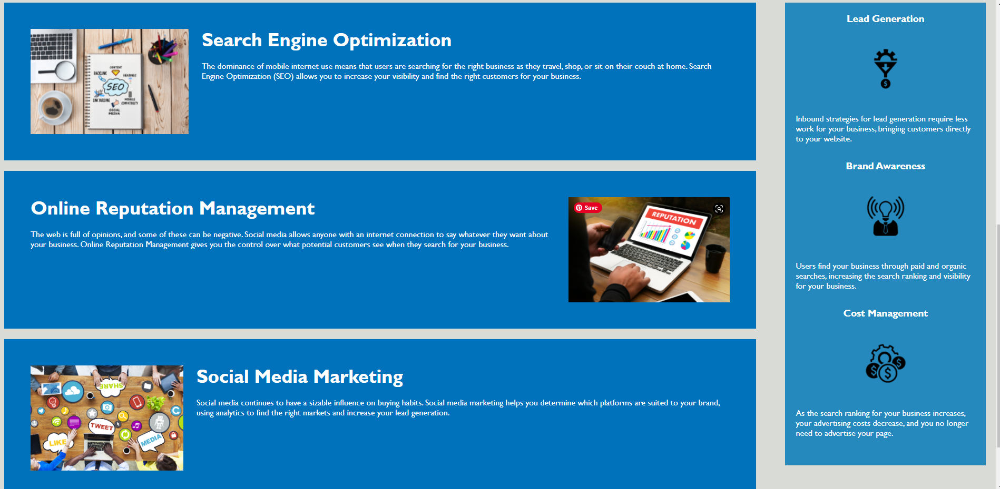

# Weather Dashboard

## Purpose
I successfully refactored the existing code to make it more accessible according to the criteria.

## User Story

```
AS A marketing agency
I WANT a codebase that follows accessibility standards
SO THAT our site is optimized for search engines
```

## Acceptance Criteria

```
GIVEN a webpage that meets accessibility standards
WHEN I view the source code
THEN I find semantic HTML elements
WHEN I view the structure of the HTML elements
THEN I find that the elements follow a logical structure independent of styling and positioning
WHEN I view the icon and image elements
THEN I find accessible alt attributes
WHEN I view the heading attributes
THEN I find that they fall in sequential order
WHEN I view the title element
THEN I find a concise, descriptive title
```

## Built With:
* HTML
* CSS

## Website
https://theresa2013.github.io/challenge-one/ 

## GitHub
https://github.com/Theresa2013/challenge-one.git 

## Screenshots



Contribution
Made by Theresa Butterfield